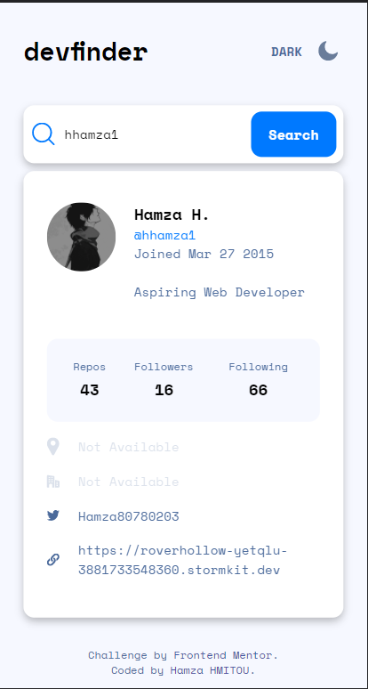
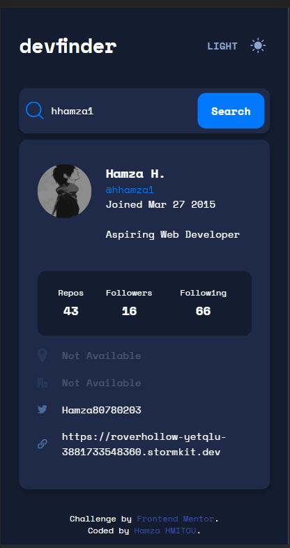
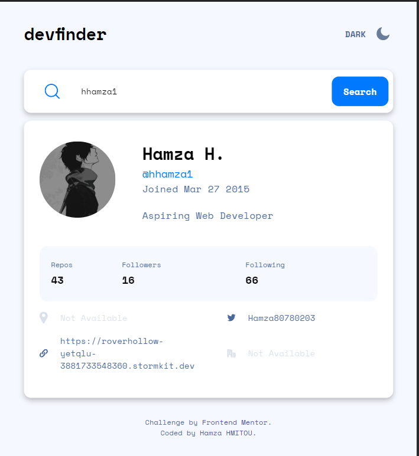
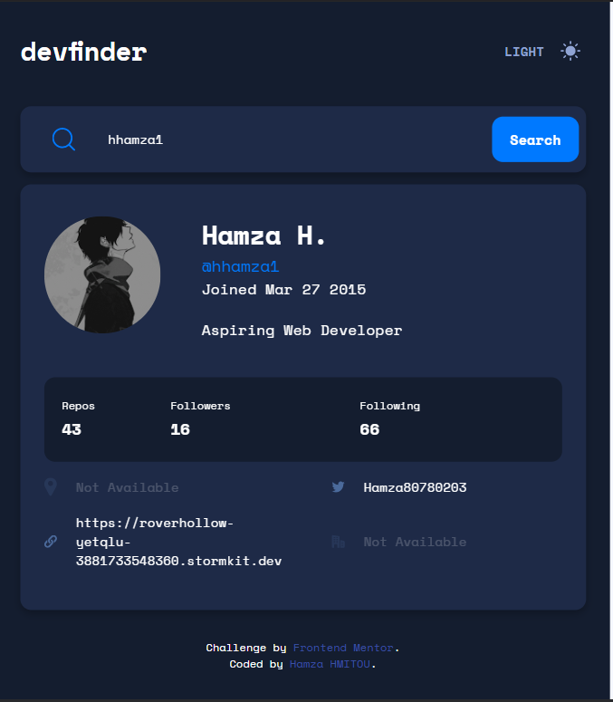
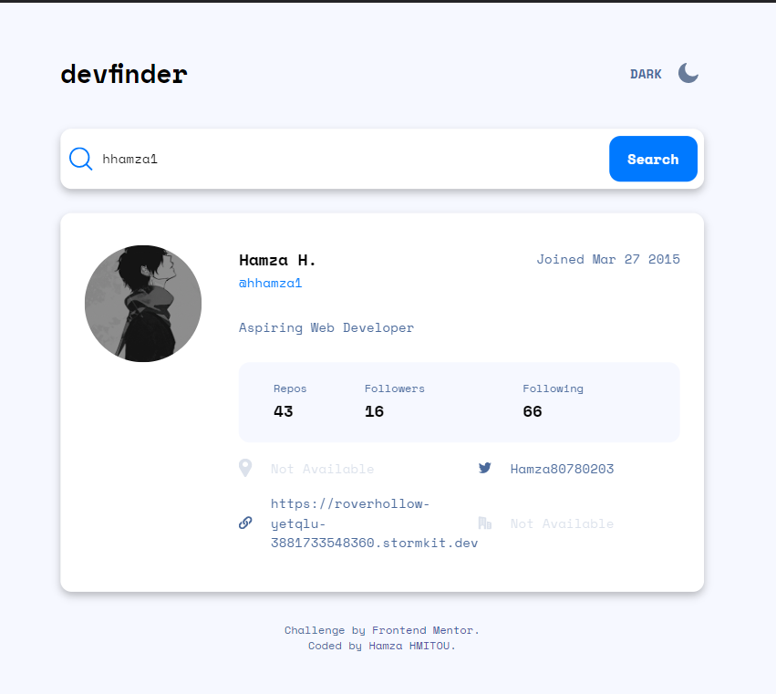
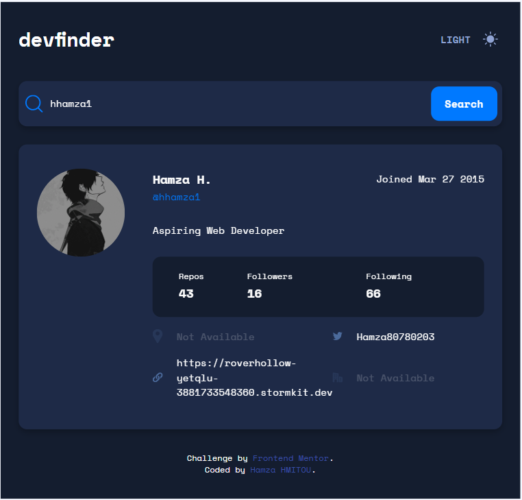

# Frontend Mentor - Github User Search App with ReactJS

This is a solution to the [Github user search app challenge on Frontend Mentor](https://www.frontendmentor.io/challenges/github-user-search-app-Q09YOgaH6)

## Table of contents

- [Overview](#overview)
  - [The challenge](#the-challenge)
  - [Screenshot](#screenshot)
  - [Links](#links)
- [My process](#my-process)
  - [Built with](#built-with)
- [Author](#author)

## Overview

### The challenge

The challenge is to build out a GitHub user search app using the GitHub users API and get itlooking as close to the design as possible. This challenge would be built using ReactJS

The users should be able to:

- View the optimal layout for the app depending on their device's screen size
- See hover states for all interactive elements on the page
- Search for GitHub users by their username
- See relevant user information based on their search
- Switch between light and dark themes
- *Bonus*: Have the correct color scheme chosen for them based on their computer preferences. Hint: Research prefers-color-scheme in CSS.

### Screenshot

#### Mobile View 
##### Light

##### Dark

#### Tablet View
##### Light

##### Dark

#### Desktop View
##### Light

##### Dark

### Links

- Solution URL: [Github Repo](https://github.com/hhamza1/fem-github-user-search)
- Live Site URL: [Live Preview](https://jolly-archimedes-d1b24c.netlify.app/)

## My process

### Built with

- React
- HTML
- CSS
- JS
- SASS
- Mobile-first workflow
- Flexbox
- Grid

## Author

- Website - [Hamza H.](https://roverhollow-yetqlu-3881733548360.stormkit.dev/)
- Frontend Mentor - [@hhamza1](https://www.frontendmentor.io/profile/hhamza1)
- Twitter - [@Hamza80780203](https://twitter.com/Hamza80780203)
